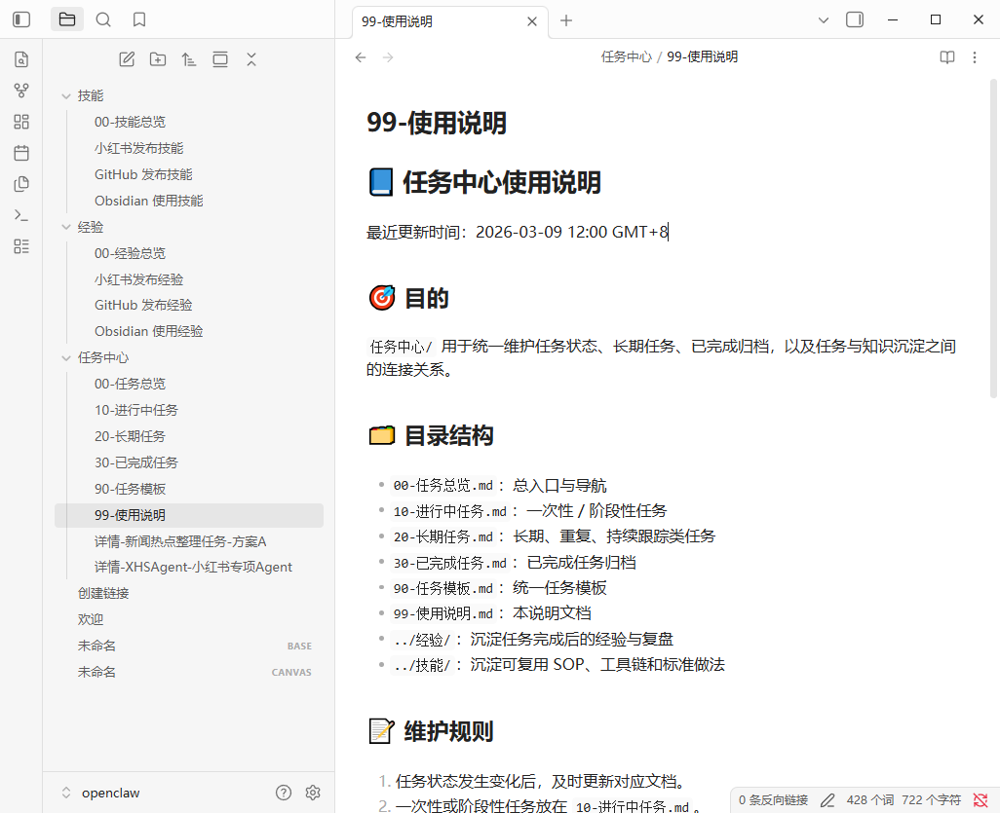
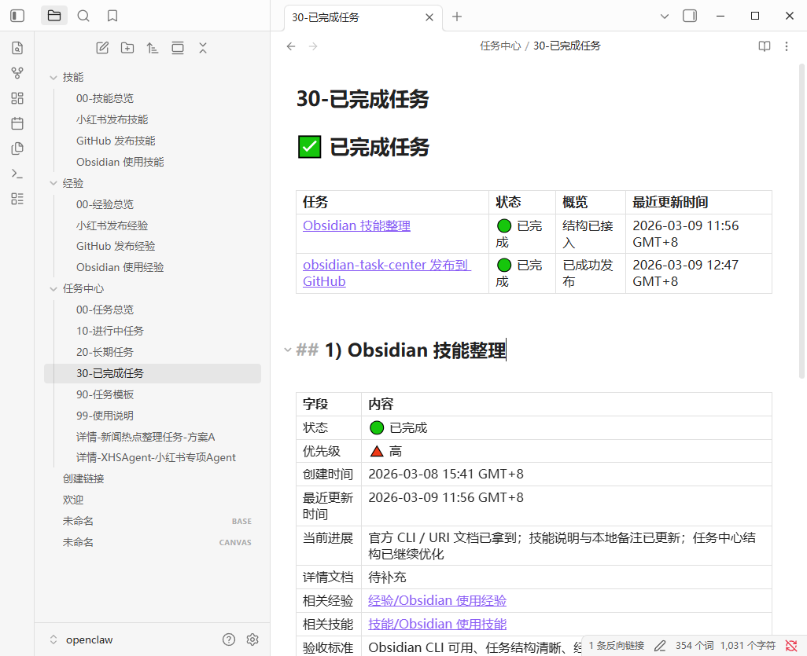
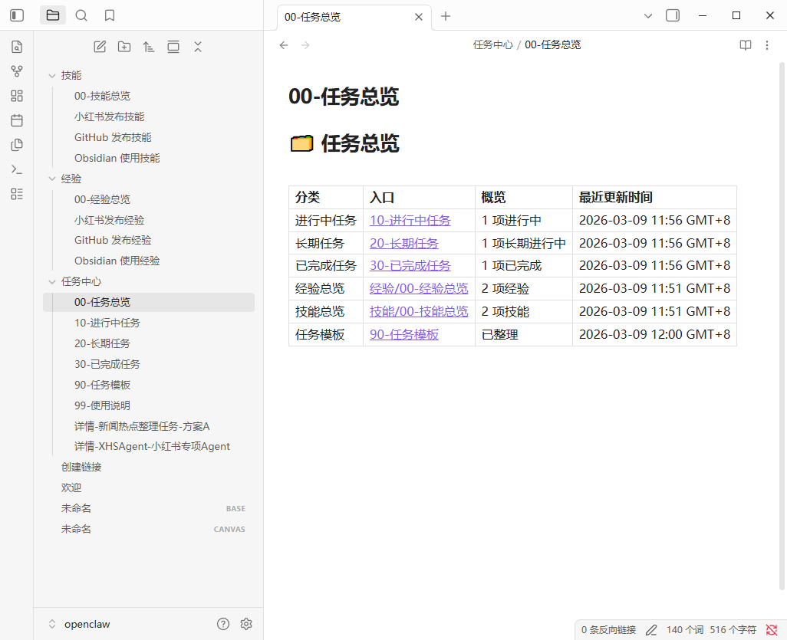

# obsidian-task-center

A reusable OpenClaw skill for organizing an Obsidian vault into a maintainable three-part workflow:

- **Task Center** — task status, details, archive
- **Experience** — lessons learned, pitfalls, post-task reflections
- **Skills** — reusable SOPs, stable workflows, repeatable methods

This skill is designed for people who want their Obsidian task system to be easy to preview, easy to maintain, and easy to extend over time.

## What this skill helps with

- Build or optimize an Obsidian **task center**
- Add **experience** and **skills** folders to create a knowledge loop
- Link tasks to related experience / skill notes
- Add **detail pages** for complex tasks
- Improve top-of-file summaries for better **hover preview readability** in Obsidian
- Clean up unused or empty parts of a vault carefully

## Included files

- `SKILL.md` — main skill instructions
- `references/example-templates.md` — examples for overview pages and summary tables
- `references/sample-vault-structure.md` — minimal vault structure you can copy
- `references/sample-task-pack.md` — complete sample task pack
- `references/cleanup-guidelines.md` — safe cleanup guidance
- `references/README.md` — reference index

## Core design ideas

1. **Three-part structure**
   - Task Center
   - Experience
   - Skills

2. **Hover-preview-first summaries**
   - Put compact summary tables at the top of overview pages
   - Let users understand a note before opening it

3. **Closed-loop maintenance**
   - A task should not just be marked done
   - After completion, check whether the task should create or improve:
     - an experience note
     - a skill note

4. **Conservative cleanup**
   - Safe to remove empty directories and truly replaced files
   - Do not blindly delete unclear notes or potentially linked pages

## Suggested usage

Use this skill when a user asks to:
- optimize their Obsidian task system
- add reusable templates
- connect tasks with learnings and reusable workflows
- make overview pages easier to scan in hover previews

## Screenshots walkthrough

Below is a visual walkthrough of the structure used in this skill.
The goal is not just to show a folder layout, but to demonstrate how tasks, experience notes, and reusable skills connect into one maintainable workflow.

### 1. Usage guide

This page explains the rules of the task center: where tasks should go, when to create detail pages, and how finished work should be written back into experience / skill notes.

### 2. Ongoing tasks

This page is used for one-off or phase-based work that is still in progress.
At the top, a compact summary table makes the page easy to scan in Obsidian hover preview.
Each task can then link to its detail page, related experience notes, and related skill notes.

### 3. Task overview

This is the main navigation page for the whole task system.
Its top summary table gives a quick view of current task states, related knowledge areas, and the latest update time for each section.

### 4. Task overview hover preview

This screenshot shows why the top-of-file summary table matters.
When hovering over links in Obsidian, the first few lines become the preview content, so the overview page is designed to expose useful status information immediately.

### 5. Task detail pages

Complex tasks should not stay as one-line entries forever.
A detail page is used to track background, steps, risks, outputs, acceptance criteria, and post-task review.
This makes long-running or multi-step work much easier to maintain.

### 6. Experience overview

The experience area stores lessons learned after tasks are completed.
These notes focus on what actually happened, what went wrong, and what should be remembered next time.

### 7. Skills overview

The skills area stores reusable methods, SOPs, and stable workflows.
Experience notes answer "what we learned"; skill notes answer "how to do this reliably next time".

### 8. Skills in practice

This screenshot shows how a concrete skill note can document usage rules, standard steps, and repeatable operating patterns.
That turns one-off work into reusable operational knowledge.

### 9. Completed tasks

Finished tasks are moved into the completed section instead of disappearing.
That keeps the task system auditable, and allows each finished task to remain connected to the related experience / skill notes it produced.

## Share / reuse

If you want to share this skill with another OpenClaw setup, the minimum recommended package is:

- `SKILL.md`
- `references/example-templates.md`
- `references/sample-vault-structure.md`
- `references/sample-task-pack.md`
- `references/cleanup-guidelines.md`

## License

MIT
