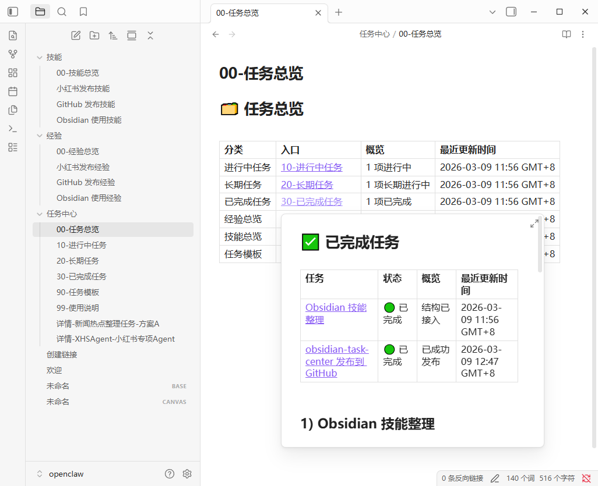
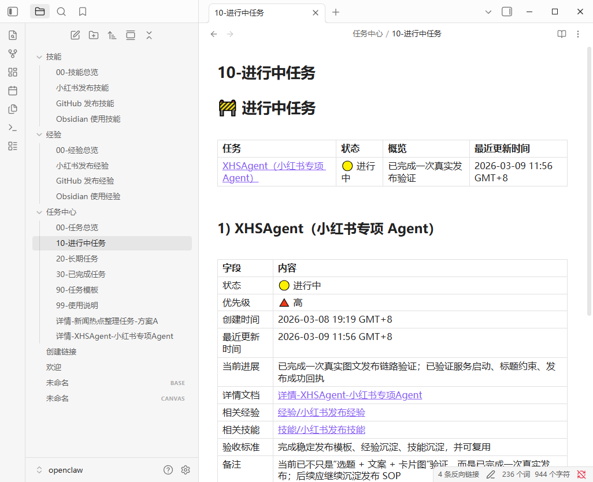
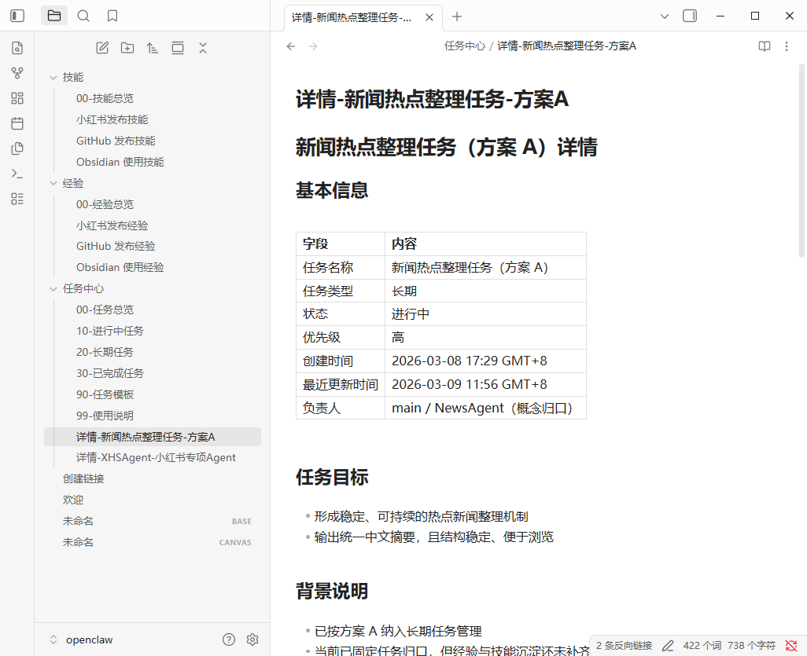
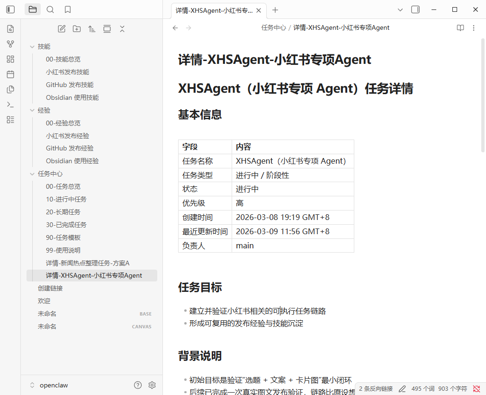
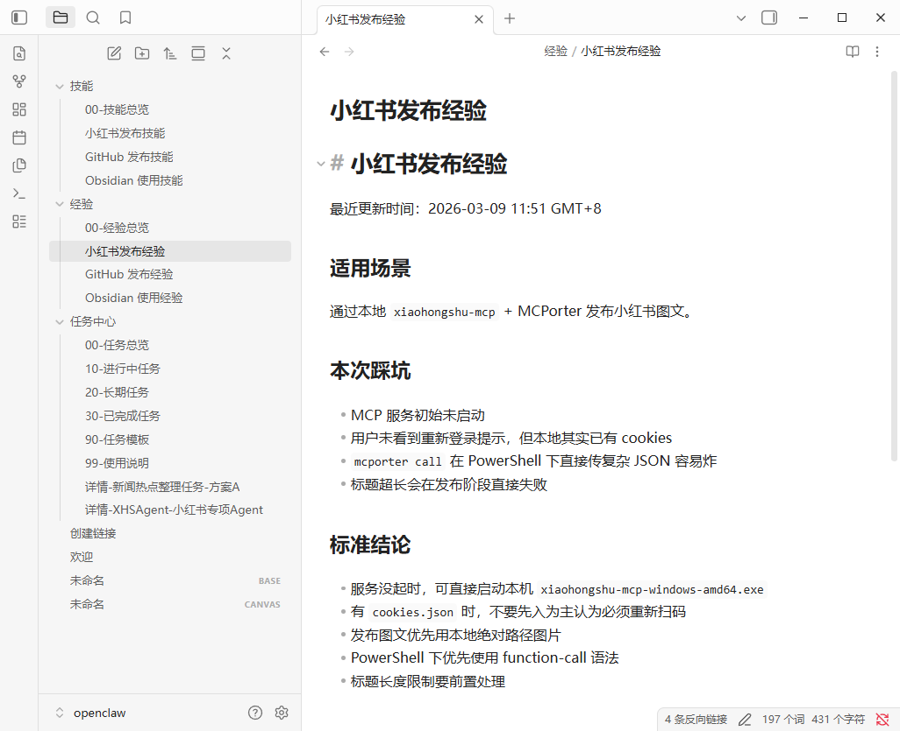
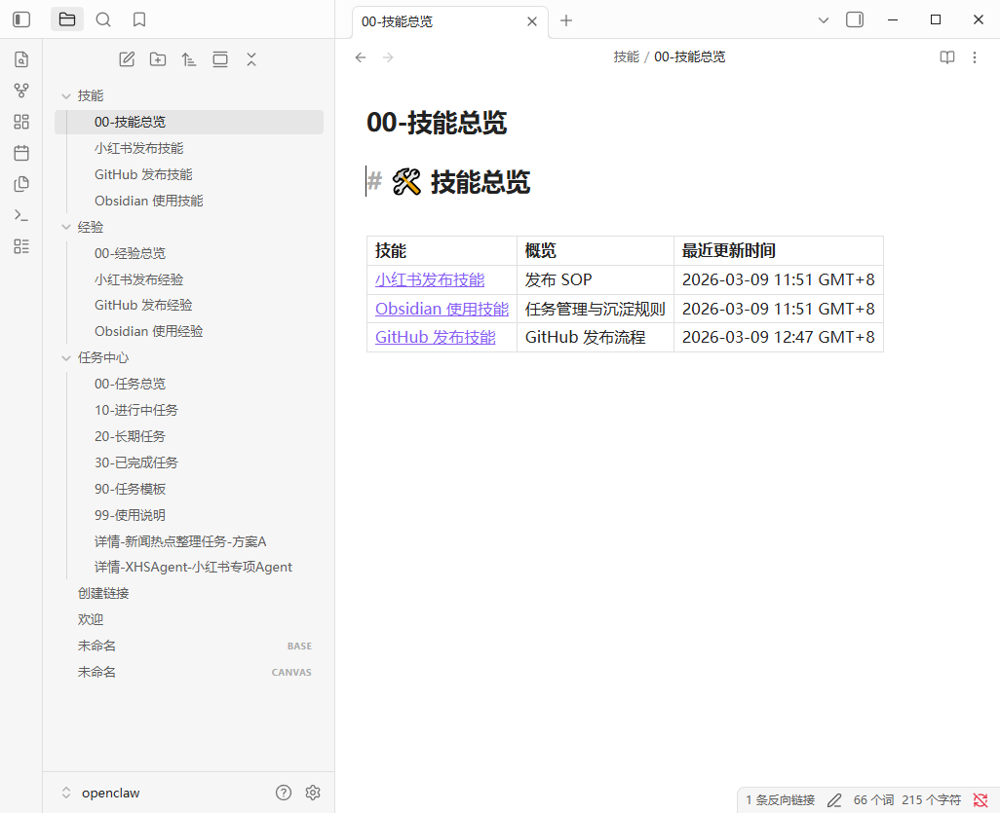
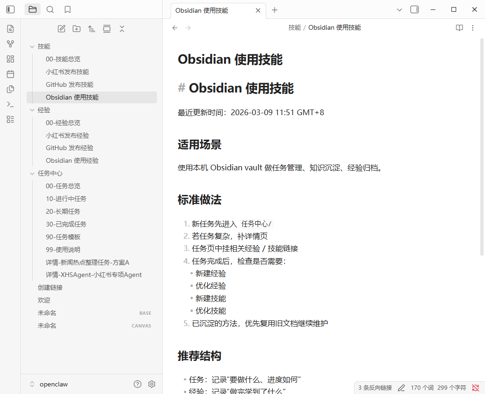

# obsidian-task-center

A reusable OpenClaw skill for organizing an Obsidian vault into a maintainable three-part workflow:

- **Task Center** — task status, details, archive
- **Experience** — lessons learned, pitfalls, post-task reflections
- **Skills** — reusable SOPs, stable workflows, repeatable methods

This skill is designed for people who want their Obsidian task system to be easy to preview, easy to maintain, and easy to extend over time.

## What this skill helps with

- Build or optimize an Obsidian **task center**
- Add **experience** and **skills** folders to create a knowledge loop
- Link tasks to related experience / skill notes
- Add **detail pages** for complex tasks
- Improve top-of-file summaries for better **hover preview readability** in Obsidian
- Clean up unused or empty parts of a vault carefully

## Included files

- `SKILL.md` — main skill instructions
- `references/example-templates.md` — examples for overview pages and summary tables
- `references/sample-vault-structure.md` — minimal vault structure you can copy
- `references/sample-task-pack.md` — complete sample task pack
- `references/cleanup-guidelines.md` — safe cleanup guidance
- `references/README.md` — reference index

## Core design ideas

1. **Three-part structure**
   - Task Center
   - Experience
   - Skills

2. **Hover-preview-first summaries**
   - Put compact summary tables at the top of overview pages
   - Let users understand a note before opening it

3. **Closed-loop maintenance**
   - A task should not just be marked done
   - After completion, check whether the task should create or improve:
     - an experience note
     - a skill note

4. **Conservative cleanup**
   - Safe to remove empty directories and truly replaced files
   - Do not blindly delete unclear notes or potentially linked pages

## Suggested usage

Use this skill when a user asks to:
- optimize their Obsidian task system
- add reusable templates
- connect tasks with learnings and reusable workflows
- make overview pages easier to scan in hover previews

## Screenshots walkthrough

Below is a visual walkthrough of the structure used in this skill.
The goal is not just to show a folder layout, but to demonstrate how tasks, experience notes, and reusable skills connect into one maintainable workflow.

### 1. Usage guide

This page defines the operating rules of the whole task center.
It explains where ongoing tasks should go, how long-term tasks are separated, when to create detail pages, and how completed tasks should feed back into experience and skill notes.

### 2. Task overview

This is the main entry point of the whole system.
Its top summary table is designed for quick scanning: users can immediately see which sections exist, what state they are in, and when they were last updated.

### 3. Task overview hover preview

This screenshot shows the hover-preview effect of the overview page.
Because Obsidian previews the first lines of a note, the top summary table becomes part of the navigation experience, not just decoration.

### 4. Ongoing tasks

This page is used for one-off or phase-based work that is still active.
Each task has a compact overview row at the top, followed by a more detailed record below, including links to detail pages, experience notes, and skill notes.

### 5. Task detail pages

Complex work should not stay only in list pages.
Detail pages are used to record background, execution steps, risks, outputs, acceptance criteria, and post-task reflections.
That makes ongoing work much easier to maintain over time.

### 6. Experience overview

The experience section collects lessons learned from finished work.
These notes focus on practical takeaways: what happened, what failed, what should be remembered, and what should be done differently next time.

### 7. Skills overview

The skills section stores reusable workflows, SOPs, and stable methods.
If experience notes are about reflection, skill notes are about repeatability.
This is where one-off work becomes reusable operational knowledge.

### 8. Skill in practice

This screenshot shows what a concrete skill note can look like in practice.
A skill note should help future work run faster and more reliably by documenting standard steps, common issues, and execution patterns.

### 9. Completed tasks

Completed tasks are moved into an archive-style finished section instead of being deleted.
That keeps the whole workflow traceable, and makes it easy to connect each finished task back to the experience and skill notes it produced.

## Share / reuse

If you want to share this skill with another OpenClaw setup, the minimum recommended package is:

- `SKILL.md`
- `references/example-templates.md`
- `references/sample-vault-structure.md`
- `references/sample-task-pack.md`
- `references/cleanup-guidelines.md`

## License

MIT
